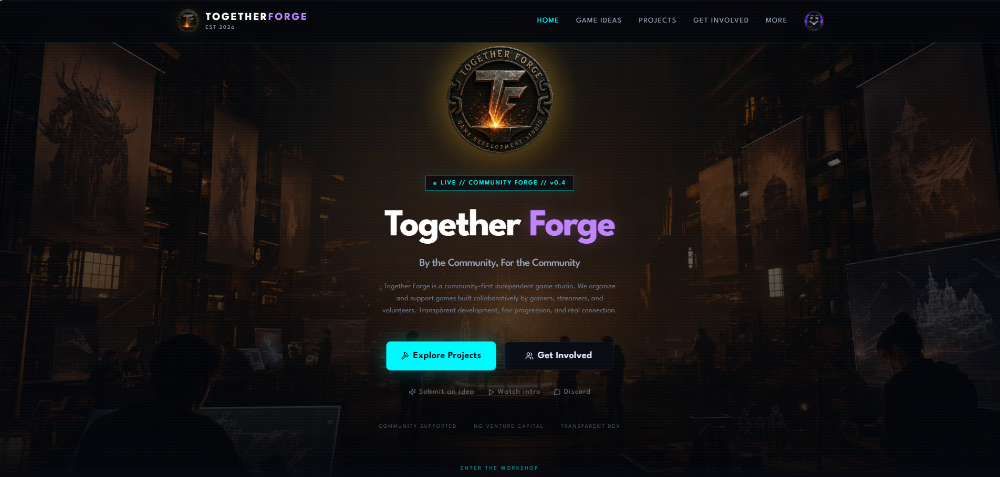
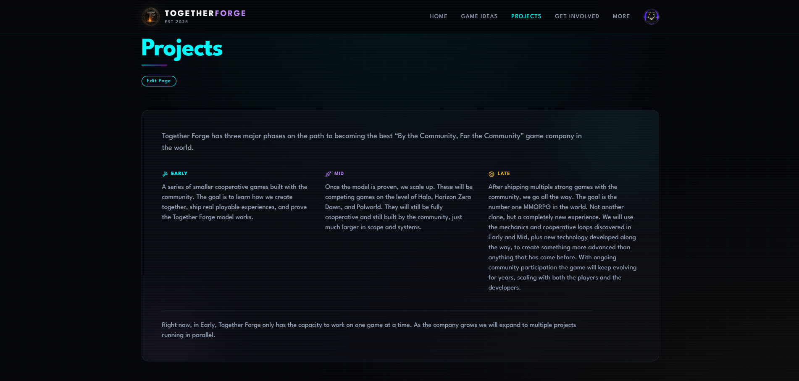
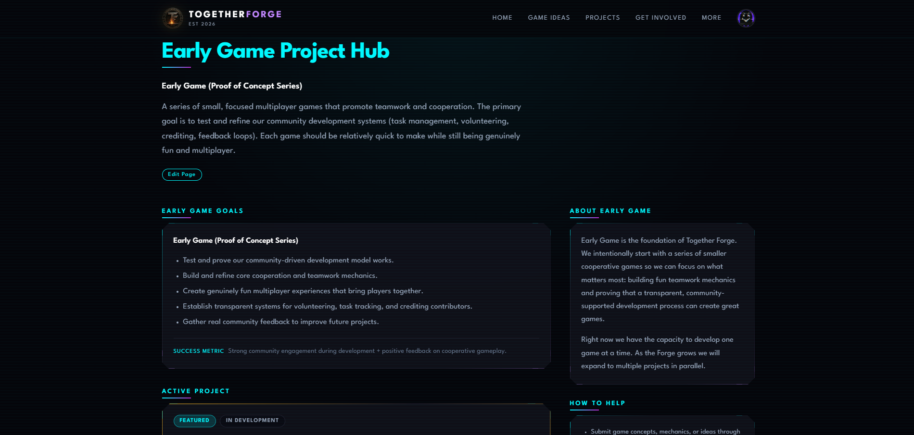
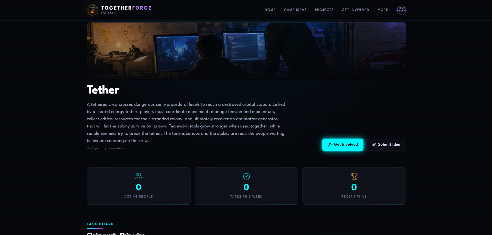
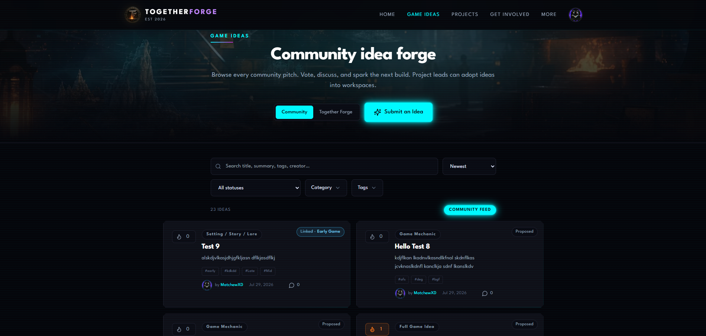
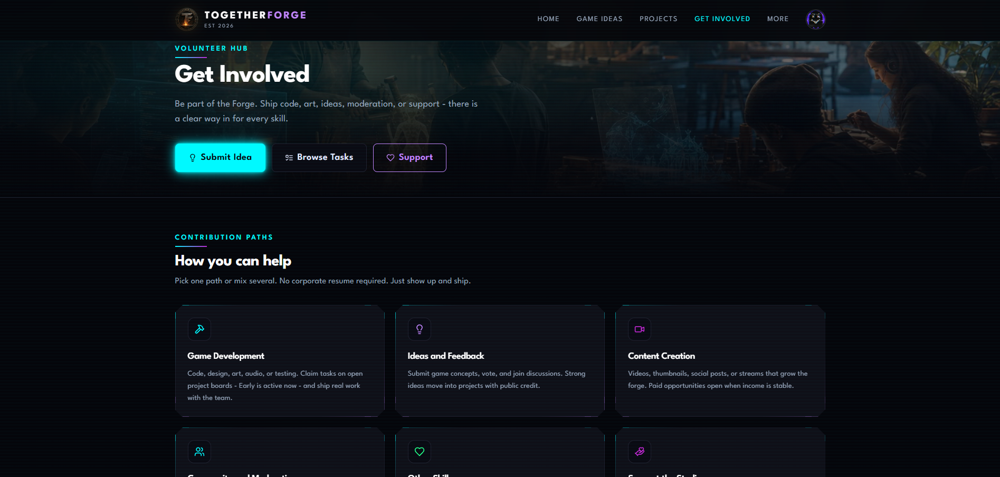

# Together Forge

**By the Community, For the Community**

An independent game studio where players, creators, and volunteers build cooperative games *together*—and keep the work transparent every step of the way.

> **Private development:** The live site is not publicly deployed yet. The screenshots below are (or will be) current previews of the website as it exists today. Drop real captures into [`readme-images/`](./readme-images/) using the exact filenames listed there so this README stays up to date for family and visitors on GitHub.

---

## What is Together Forge?

Together Forge is a community-first game studio with a simple belief:

**Good games should put players first—not shareholders, not hype cycles, and not disposable products built only to extract money.**

We invite people who love games to share ideas, claim real work, ship playable experiences, and see how support is used. Contributions are credited. Progress is public. The long-term aim is a studio that grows *with* its community, from small co-op prototypes all the way to ambitious multiplayer worlds.

If you care about fun, teamwork, and honest development, you already understand the spirit of the Forge.

---

## The Vision

Together Forge grows in three clear stages. We talk about them as **Early Game**, **Mid Game**, and **Late Game**—a path, not a marketing slogan.

### Early Game
Smaller cooperative games built with the community. The goal is to learn how we create together, ship real playable experiences, and prove that a transparent, community-supported studio can work.

Right now the Forge focuses on **one game at a time** so quality and collaboration stay strong.

### Mid Game
Once the model is proven, we scale up. Larger cooperative games—ambitious systems, bigger worlds—still built with the community, just with more scope and firepower.

### Late Game
After shipping multiple strong titles together, the long-term dream: a completely new kind of **MMORPG** shaped by the mechanics, cooperation, and technology discovered along the way—kept alive and evolving with ongoing community participation.

---

## Current Active Project: Tether

**Tether** is our active Early Game project.

A tethered crew crosses dangerous semi-procedural levels toward a destroyed orbital station. Linked by a shared energy tether, players coordinate movement, manage tension and resources for a stranded colony, and fight to recover a permanent power source. Teamwork tools grow stronger when used together; the tone is serious, and the stakes are real.

Volunteers can open the live project workspace, claim tasks, submit ideas, and follow progress as the game takes shape.

---

## Website Preview

These images show the current website experience. Until screenshots are added, GitHub may show a broken-image icon—that is expected.

**How to fill them in:** run the site locally, capture each screen, and save the files into [`readme-images/`](./readme-images/) using the **exact names** below. Do not rename the files unless you also update this README.

| File | What to capture |
|------|-----------------|
| `home.png` | Home page hero and main sections |
| `projects-landing.png` | Projects landing (vision + Early / Mid / Late cards) |
| `early-phase.png` | Early Game hub (goals, active project, ideas) |
| `tether-project.png` | Tether project workspace / task board |
| `ideas-page.png` | Community Ideas board |
| `get-involved.png` | Get Involved page |

### Home



*Caption: The Together Forge home page—hero, studio message, and entry points into projects, ideas, and community.*

### Projects landing



*Caption: The Projects landing page—Early, Mid, and Late Game vision, with Tether featured as the active Early Game project.*

### Early Game hub



*Caption: The Early Game Project Hub—goals, the featured Tether card, target style, and community ideas for Early Game.*

### Tether project workspace



*Caption: The Tether workspace—task board, claims, and day-to-day collaboration for the active game.*

### Ideas board



*Caption: The Ideas page—community pitches, mechanics, and systems, with voting and filters.*

### Get Involved



*Caption: The Get Involved page—how people can volunteer, support the studio, and join the work.*

---

## How the Community Can Participate

You do not need to be a full-time developer to help. The site is built so different kinds of people can plug in:

- **Share ideas** — full game concepts, mechanics, systems, stories, and more  
- **Work on tasks** — claim real work on open projects like Tether  
- **Give feedback** — test, comment, and improve what ships  
- **Create** — art, design, writing, audio, and other crafts as needs appear  
- **Support the studio** — tools, hosting, and operations (tracked with transparency)  
- **Spread the word** — streamers, friends, and communities who care about co-op games  

Accounts unlock drafts, dashboards, claims, and personal progress. Staff keep boards healthy so the community can focus on making good games.

---

## Current Status

| Area | Status |
|------|--------|
| Website (app shell, pages, design system) | Active development |
| Ideas (submit, wizard, drafts, voting, comments) | Working in private builds |
| Early Game hub + Tether workspace | Live in private builds |
| Mid / Late Game | Planned vision pages; open when the studio is ready |
| Community support / transparency | Foundations in place |
| Public deployment | **Not public yet** |

This repository is the home of the Together Forge **website**—the front door for the studio, projects, ideas, and community workflows. Game source code for individual titles may live in separate places as projects mature.

---

## Tech / Repo notes

*This section is for developers. Family and visitors can skip it.*

- **Stack:** React 19, Vite, React Router, Tailwind CSS, Supabase  
- **App:** SPA under `src/` (pages, components, services)  
- **Data:** Supabase SQL and edge functions under `supabase/`  
- **Scripts:**

```bash
npm install
npm run dev      # local development
npm run build    # production build
npm test         # unit tests
```

- **Screenshots:** see [`readme-images/README.md`](./readme-images/README.md)

---

## Closing

Together Forge is ambitious on purpose: start small, stay honest, grow with the people who show up.

**By the Community, For the Community.**

If you are reading this on GitHub while the site is still private—thank you for caring enough to look. The best is still being forged.
